# Automata

Two [Omarchy](https://omarchy.org/) themes, dark (this repo) and
[light](https://github.com/eliasfaltin/omarchy-automata-light-theme), with six
generated backgrounds. Each background is an automaton you can watch: a
cellular automaton, a clock escapement, Conway's Game of Life, a colony of
glider guns. Every one
ships as a still, a seamless loop, and a one-shot intro that plays at login.

| Automata (dark) | Automata Light |
| --- | --- |
| 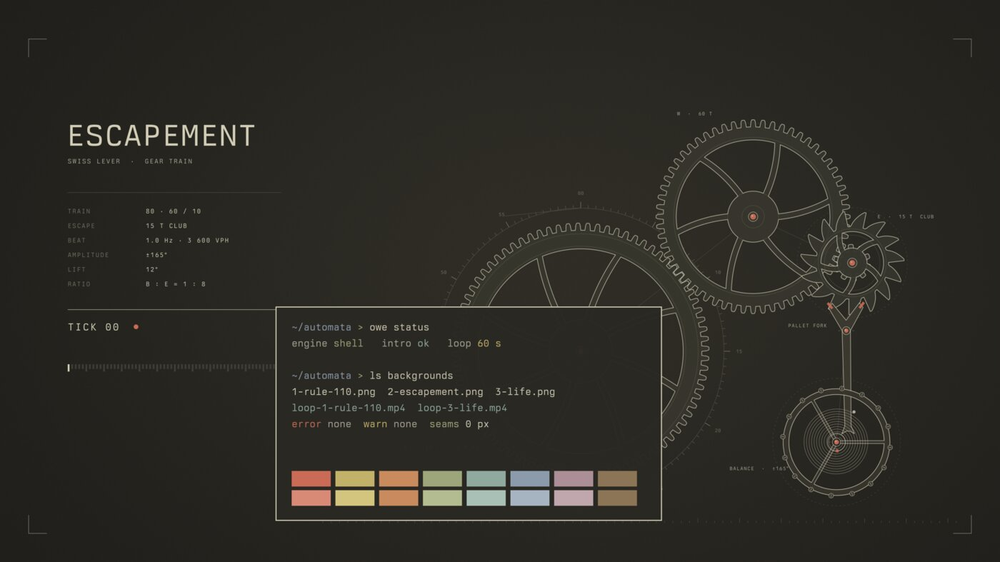 | 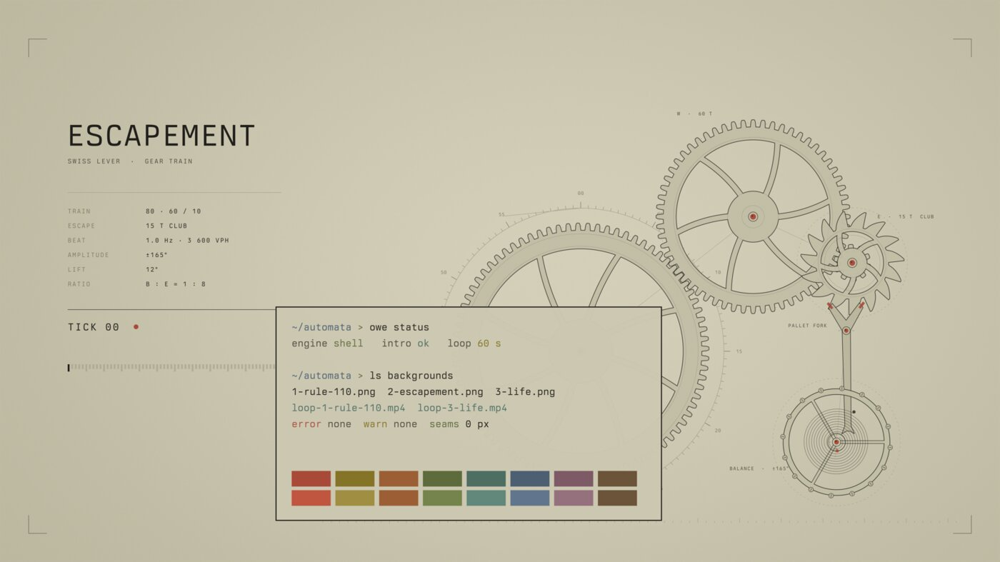 |

## Inspiration

The palette comes from the **NieR: Automata** theme for T3 Code on
[T3 Themes](https://t3themes.com/themes/nier-automata/), by
[SunkenInTime](https://github.com/SunkenInTime)
([source JSON](https://github.com/SunkenInTime/t3-themes/blob/main/themes/nier-automata.json)):

> YoRHa's parchment-and-ink interface: sepia light mode, charcoal dark
> variant, monochrome accents. Glory to mankind.

This project takes that palette to the whole desktop:

- the paper, ink and muted colours come straight from the original;
- the terminal colours are new, low-saturation hues in the same tones;
- the backgrounds are original generated art, not game art.

## Backgrounds

All six are rendered from code in [`src/`](src/). The previews are small
WebP clips; the real files are 3840x2160 (16:9) and 3240x2160 (3:2), H.264.
The loop runs while the background is visible. The intro plays once at login
and ends on the loop's first frame.

| Background | Loop | Intro |
| --- | --- | --- |
| **1 · Rule 110.** An elementary cellular automaton, computed row by row. The loop sweeps a read head over the generations. 12 s. | 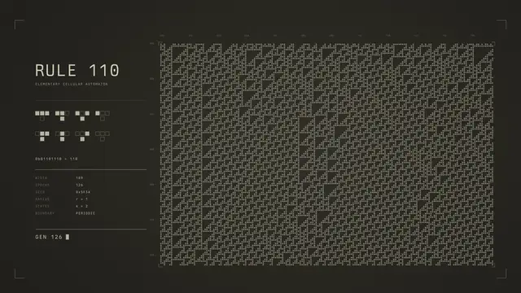 | 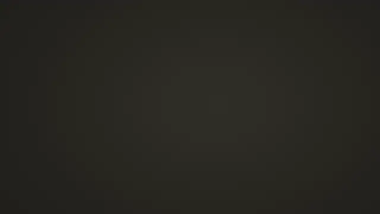 |
| **2 · Escapement.** A Swiss lever escapement and gear train. It ticks once per second; every wheel turns a whole number of spoke periods per minute. 60 s. | 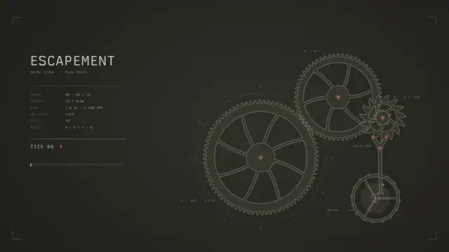 | 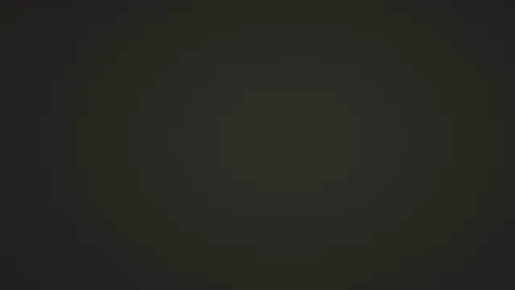 |
| **3 · Life.** A Gosper glider gun feeds an eater beside a catalogue of oscillators and still lifes. The universe repeats every 30 generations. 15 s. | 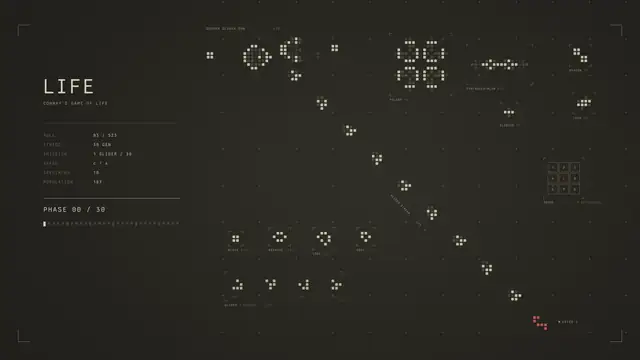 | 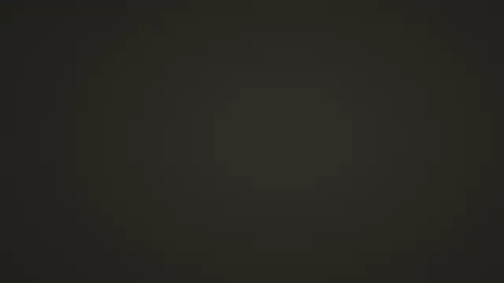 |
| **4 · Cyclic.** Griffeath's cyclic cellular automaton (8 states, radius 2, threshold 3). Noise organises into spiral waves that glide at a constant pace. No text. 8 s. | 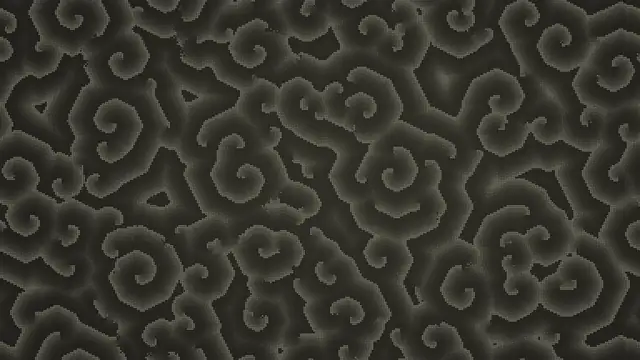 | 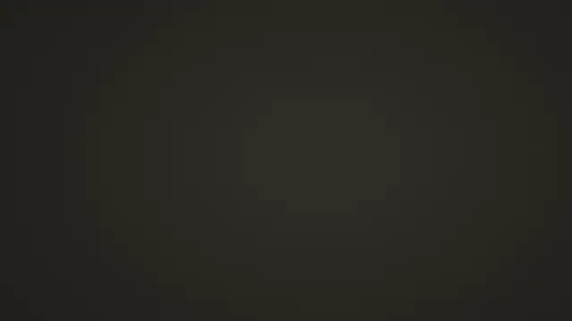 |
| **5 · Gears.** A lattice of large and small gears; every neighbour pair meshes. No text. 30 s. | 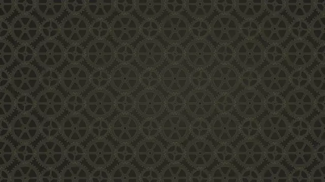 | 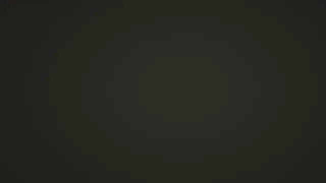 |
| **6 · Colony.** Ten glider guns in random orientations fire streams of gliders across the screen into eaters, between clusters of oscillators and still lifes. Moving cells are brighter. No text. 12 s. | 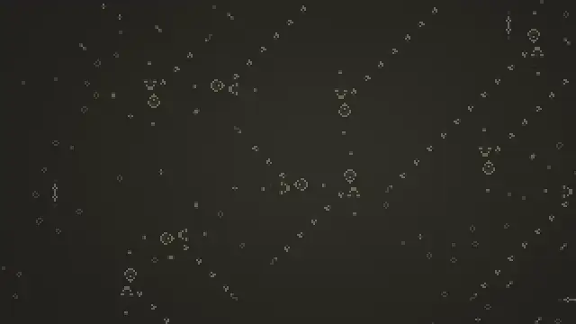 | 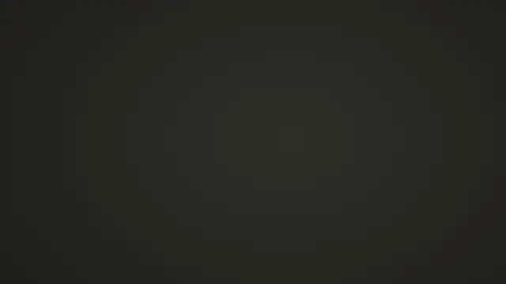 |

Automata Light carries the same six in charcoal on parchment; see its
[README](https://github.com/eliasfaltin/omarchy-automata-light-theme) for
light previews.

| | | |
| --- | --- | --- |
| 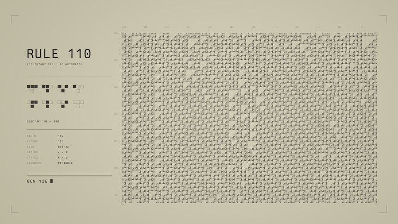 | 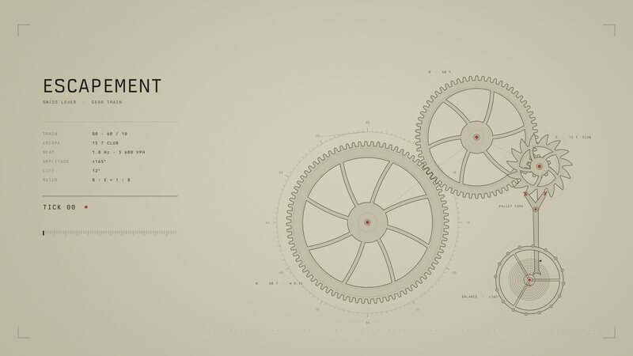 | 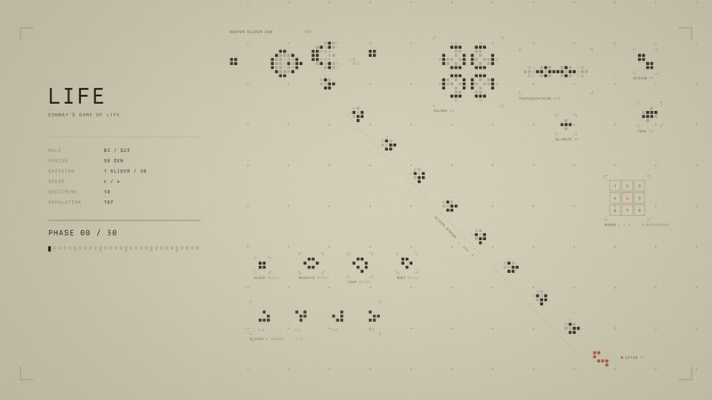 |
| 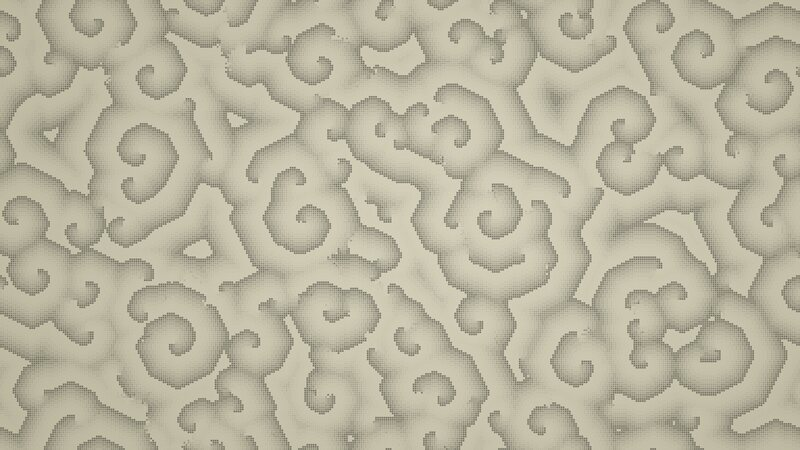 | 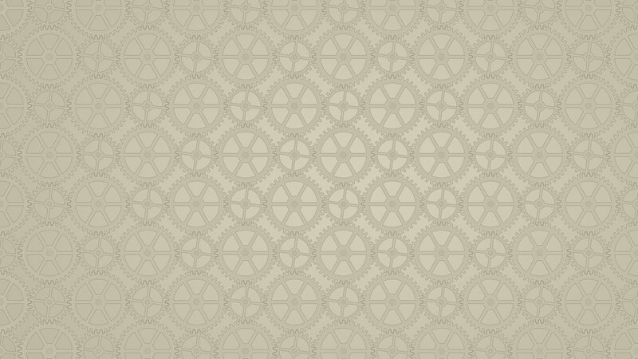 | 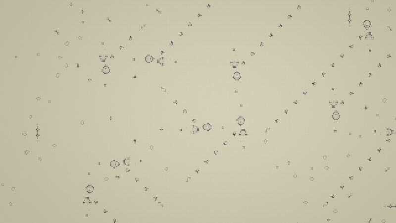 |

The still, the intro's last frame and the loop's first frame are the same
image, pixel for pixel, so the handover between them has no visible cut.

## How it works

- **Stills and loops** are ordinary Omarchy backgrounds. Pick one with
  `Super + Ctrl + Space`. Loops are the `loop-*` entries.
- **Intros** play through [OWE](https://github.com/omacom/owe), Omarchy's
  wallpaper engine, with `owe intro`. `automata-intro` runs at Hyprland start:
  it shows the blank first frame, plays the intro, then hands back to the
  still or the loop.
- **16:9 and 3:2.** Omarchy draws one file on every screen and crops it to
  fill, which cuts the side of a 16:9 plate on a 3:2 laptop. So every
  background exists in both layouts. `automata-aspect watch` listens for
  Hyprland monitor events and links the render that fits the largest enabled
  monitor.

## Install

Requires Omarchy with OWE 0.2.7 or later (`omarchy pkg add owe`).

```bash
omarchy theme install https://github.com/eliasfaltin/omarchy-automata-theme
omarchy theme install https://github.com/eliasfaltin/omarchy-automata-light-theme   # optional
~/.config/omarchy/themes/automata/bin/automata-setup
```

The first two commands install the themes with every background, loop and
intro in 16:9. Each repo is about 300 MB. `omarchy theme update` keeps them
current.

Omarchy runs no code from an installed theme, so `automata-setup` adds the
extras once:

- `automata-intro`, `automata-aspect` and `automata-bg` in `~/.local/bin/`
- a theme-set hook and two lines in `~/.config/hypr/autostart.lua`
- the 3:2 renders for both themes (about 480 MB), from the
  [`media-v1` release](https://github.com/eliasfaltin/omarchy-automata-theme/releases/tag/media-v1),
  into `~/.local/share/automata/variants/`

Without the setup script, the themes still work: every still and loop is in
the background switcher. You lose the login intro and the 3:2 layouts. Use
`automata-setup --no-3x2` to skip the download.

### Commands

```bash
automata-bg toggle        # switch between the current still and its loop
automata-intro            # replay the intro
automata-aspect current   # layout for the current monitors: 16x9 or 3x2
AUTOMATA_ASPECT=3x2 automata-aspect apply   # force a layout
```

### Uninstall

```bash
rm -rf ~/.config/omarchy/themes/automata ~/.config/omarchy/themes/automata-light
rm -rf ~/.local/share/automata ~/.local/bin/automata-*
rm ~/.config/omarchy/hooks/theme-set.d/20-automata-aspect
# then delete the two automata lines from ~/.config/hypr/autostart.lua
```

## Rendering

The renderers need Python 3 with `pycairo` and `numpy`, plus `ffmpeg`.
Output goes to `~/.local/share/automata/variants/<mode-aspect>/`. Each script
renders one background:

```bash
cd src
AUTOMATA_MODE=light AUTOMATA_ASPECT=3x2 python3 cyclic.py all   # still, intro, loop, blank
python3 rule110.py preview 3.0 intro                            # one frame to src/preview/
```

`AUTOMATA_MODE` is `dark` or `light`, and `AUTOMATA_ASPECT` is `16x9` or
`3x2`. The published renders use Berkeley Mono for the labels; set
`AUTOMATA_FONT` to any installed monospace family.

Every loop is exact, not cross-faded:

- the gear trains turn a whole number of spoke periods per loop;
- the Game of Life boards are simulated until they repeat exactly;
- the cyclic automaton is simulated until it repeats.

## License

MIT. See [LICENSE](LICENSE). The NieR: Automata name and the original
palette belong to their owners; this project only borrows the colours.
